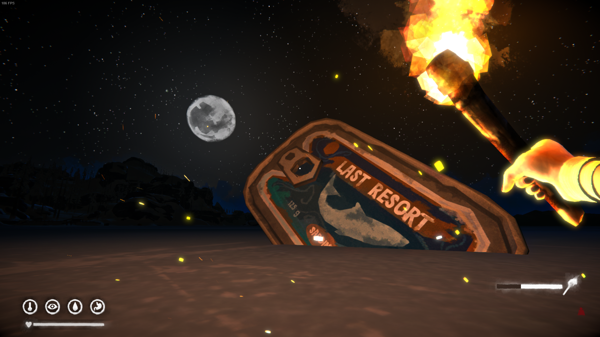

# Features
- Enable physics for gear items (enabled after placing, not constantly)
- Enable collision with gear items 
- Other silly stuff, mostly related to resizing things

# Installation
- Drop into `../Mods/`
- Requires [ModSettings](https://github.com/zeobviouslyfakeacc/ModSettings/releases)
